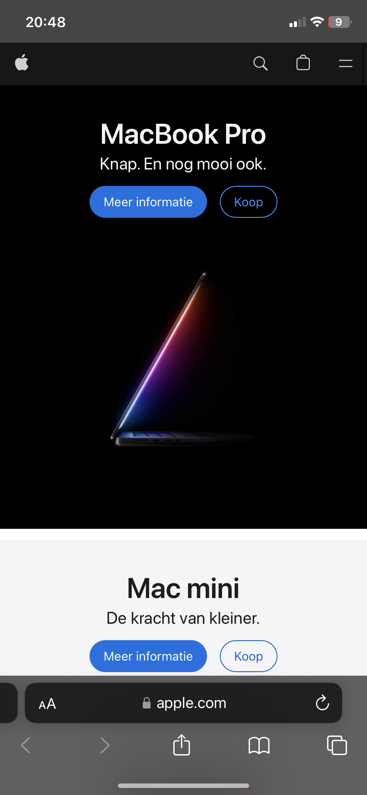
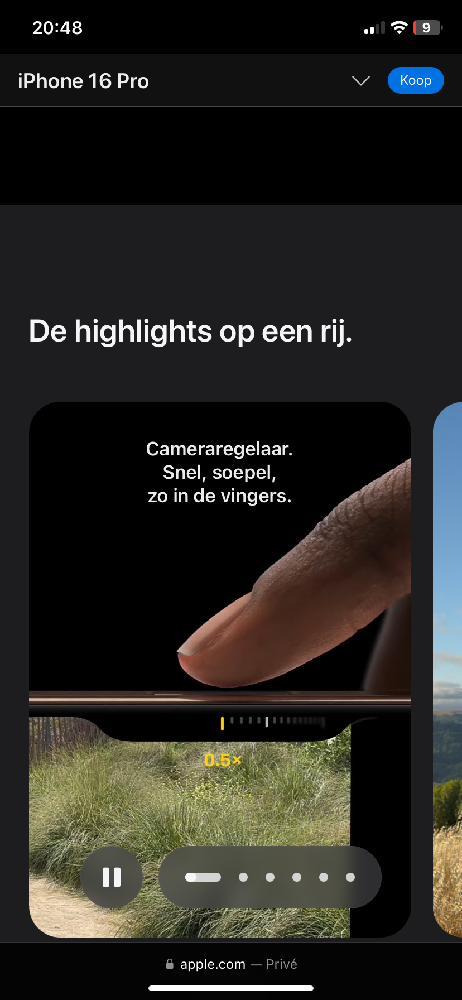

# Procesverslag
Markdown is een simpele manier om HTML te schrijven.  
Markdown cheat cheet: [Hulp bij het schrijven van Markdown](https://github.com/adam-p/markdown-here/wiki/Markdown-Cheatsheet).

Nb. De standaardstructuur en de spartaanse opmaak van de README.md zijn helemaal prima. Het gaat om de inhoud van je procesverslag. Besteedt de tijd voor pracht en praal aan je website.

Nb. Door *open* toe te voegen aan een *details* element kun je deze standaard open zetten. Fijn om dat steeds voor de relevante stuk(ken) te doen.

## Jij

  
uitwerken voor kick-off werkgroep

  ### Auteur:
  Thomas Plas

  #### Je startniveau:
  Rood/Zwart

  #### Je focus:
  surface plane
 

## Je website

  
uitwerken voor kick-off werkgroep

  ### Je opdracht:
  https://www.apple.com/nl/

  #### Screenshot(s) van de eerste pagina (small screen): 
  hier de naam van de pagina  
  

  #### Screenshot(s) van de tweede pagina (small screen):
  hier de naam van de pagina  
  
 

## Toegankelijkheidstest 1/2 (week 1)

  
uitwerken na test in 2e werkgroep

  ### Bevindingen
  Lijst met je bevindingen die in de test naar voren kwamen:
  - In de screen reader ga je langs de footnotes maar dit zijn alleen nummers dus dit is erg onduidelijk
  - Er word gebruik gemaakt van h1,h2 tot h6 maar dit lijkt mij een beetje veel
  - Door de interface heen gaan ging best goed met de screenreader
  - Er was geen dark en light mode aanwezig. de pagina van de iPhone16 is opzichzelf al een darkmode maar de cadeau pagina is een lightmode ookal zet je deze om
  - als je door het menu heen gaat krijg je de optie om het te openen of niet

## Breakdownschets (week 1)

  
uitwerken na afloop 3e werkgroep

  ### de hele pagina: 
  
  

  ### dynamisch deel (bijv menu): 
  

  ### wellicht nog een dynamisch deel (bijv filter): 
  

## Voortgang 1 (week 2)

  
uitwerken voor 1e voortgang

  ### Stand van zaken
  hier dit ging goed & dit was lastig (neem ook screenshots op van delen van je website en code):
    Ik vind code zeld best lastig maar probeer een actieve houding aan te nemen dit blok door vooruit te werken zodat ik vragen kan stellen in de les en beter mee kan doen. Dit heeft tot nu toe goed gewerkt en ik merk hierdoor ook dat ik makkelijker dingen oppak

  ### Agenda voor meeting
  samen met je groepje opstellen

  | Thomas         | Izaira             | Rens         | Jerry            |
  | ---            | ---                | ---          | ---              |
  | pixels bijresponsiveness     | en dit             | en ik dit    | en dan ik dat    |
  |  | dit als er tijd is | nog een punt | dit wil ik zeker |
  |  is een background img symatisch en een probleem qua toegankelijkheid          | ...                | ...          | ...              |
  |          | ...                | ...          | ...              |
  |  veel kleuren in mijn site maar mag ik dit inkorten| ...               | ...          | ...              |
  | | ...               | ...          | ...              |

  ### Verslag van meeting
  hier na afloop snel de uitkomsten van de meeting vastleggen

  - 1. ik kan gewoon met een converter de pixels omzetten naar em's
  - 2. als een achtergrond alleen maar voor mooi is en niet specifiek betekenisvol is kan je deze ook als background image gebruiken omdat de screenreader dan niet overheen leest
  - 3. ik mag minder kleuren gebruiken in mijn site dan dat apple gebruikt omdat apple er wel heel veel heeft

## Voortgang 2 (week 3)

  
uitwerken voor 2e voortgang

  ### Stand van zaken
  hier dit ging goed & dit was lastig (neem ook screenshots op van delen van je website en code):
    Ik heb mijn eerste pagina voor een groot gedeelte af maar ik merk dat ik nu wat moeilijkere code wil gaan uitproberen maar ik kijk meteen naar het resultaat en zie de bomen door het bos niet meer. Ik ga dus nu proberen om stap voor stap de verschillende code aan te pakken

  ### Agenda voor meeting
  samen met je groepje opstellen

  | Thomas      | Izaira        | Rens   | Jerry        |
  | ---            | ---                | ---          | ---              |
  |                | en dit             | en ik dit    | en dan ik dat    |
  | ik heb een bug wanneer ik een background blur maak dat de aanpassingen voor het hamburgermenu ongedaan| dit als er tijd is | nog een punt | dit wil ik zeker |
  | ik wil een beetje hulp met de carousel die alleen met css wordt gedaan op de websit van bramus            | ...                | ...          | ...              |
  | waar kan ik goeie info vinden voor scroll based animations            | ---                | ---          | ---              |
  | ---            | ---                | ---          | ---              |
  | ---            | ---                | ---          | ---              |

  ### Verslag van meeting
  hier na afloop snel de uitkomsten van de meeting vastleggen

  - als feebback kreeg ik om voor mijn javascript bug beter hier later naar kunnen kijken,
  - Ik moest mij eerst focussen op mijn tweede pagina
  - voor scrollbases animatie kon ik kijken naar (https://scroll-driven-animations.style/). 
  - voor de carousel kreeg ik een voorbeeldje van jesse:(https://codepen.io/OvenMagnetron/pen/PoMoLOM).
- ...
 

## Toegankelijkheidstest 2/2 (week 4)

  
uitwerken na test in 9e werkgroep

  ### Bevindingen
  Lijst met je bevindingen die in de test naar voren kwamen (geef ook aan wat er verbeterd is):

## Voortgang 3 (week 4)

  
uitwerken voor 3e voortgang

  ### Stand van zaken
  hier dit ging goed & dit was lastig (neem ook screenshots op van delen van je website en code)
    Ik ben erg tevreden met wat ik tot nu toe heb gemaakt alleen moet ik nu nog echt even een sprintje zetten voor de eindoplevering om alles netjes af te maken.

  ### Agenda voor meeting
  samen met je groepje opstellen

  | Thomas     | Izaira        | Rens    | student 4        |
  | ---            | ---                | ---          | ---              |
  | mijn 2de pagina is op zichzelf al een darkmode. wat moet ik dan doen voor de lightmode vooral omdat alle foto's zwart zijn  | en dit             | en ik dit    | en dan ik dat    |
  | Volgens MDN mag je een Name geven aan een details zodat er maar 1 open kan per keer maar ik krijg hier een foutmelding uit dus is dit goed | dit als er tijd is | nog een punt | dit wil ik zeker |
  | ...            | ...                | ...          | ...              |

  ### Verslag van meeting
  hier na afloop snel de uitkomsten van de meeting vastleggen

  - ik moest overflow gebruiken omdat bij mijn scrollbased animation de randen buiten het scherm vielen. (ik snapte dit eerst niet omdat ik overflow hidden had toegepast maar dan gaat de scroll animation stuk maar met clip blijft hij wel werken)
  - ik mag de foto's inverten bij de light mode als dit er cool uit ziet
  - het was goed om een name te gebruiken voor details
  - we kregen uitleg over hoe een carousel te maken wat ik al had maar we kregen wel wat extra info over hoe wij knoppen konden gebruiken om vooruit en achteruit te gaan
  - ik had een probleem met de blurred background dat mijn volledige pagina buggy werd. de student assistenten hadden mij verteld dat ik dit moest oplossen als ik tijd over had maar Sanne gaf aan dat ik de items los moest koppelen van de header waardoor de menu items niet zouden breken.

## Eindgesprek (week 5)

  
uitwerken voor eindgesprek

  ### Je uitkomst - karakteristiek screenshots:
  

  ### Dit ging goed/Heb ik geleerd: 
  Korte omschrijving met plaatjes

  

  ### Dit was lastig/Is niet gelukt:
  Korte omschrijving met plaatjes

  

## Bronnenlijst

  
continu bijhouden terwijl je werkt

  Nb. Wees specifiek ('css-tricks' als bron is bijv. niet specifiek genoeg). 
  Nb. ChatGpT en andere AI horen er ook bij.
  Nb. Vermeld de bronnen ook in je code.

  1. [bron 1](https://stackoverflow.com/questions/65257333/svg-inside-h1-tag)
  2. bron 2
  3. ...

